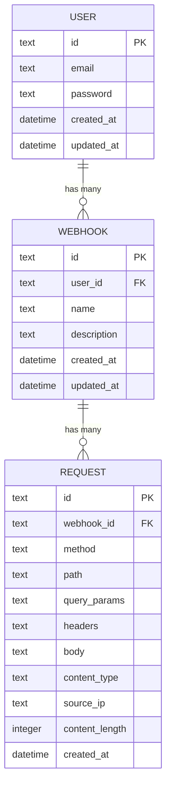

# Data Model

## Entities Overview

| Entity | Purpose |
|--------|---------|
| User | Single admin user, holds login credentials |
| Webhook | A named endpoint with unique UUID for receiving HTTP requests |
| Request | A captured incoming HTTP request to a webhook |

## Entity Details

### Entity: User

| Attribute | Type | Constraints | Notes |
|-----------|------|-------------|-------|
| id | TEXT (UUID) | PK | Auto-generated UUID v4 |
| email | TEXT | UNIQUE, NOT NULL | Admin login identifier |
| password | TEXT | NOT NULL | bcrypt hash |
| created_at | DATETIME | DEFAULT CURRENT_TIMESTAMP | Record creation |
| updated_at | DATETIME | DEFAULT CURRENT_TIMESTAMP | Last modification |

#### Validation Rules

| Rule | Description |
|------|-------------|
| Email format | Must be valid email address |
| Password min length | At least 8 characters (enforced at change-password time) |

### Entity: Webhook

| Attribute | Type | Constraints | Notes |
|-----------|------|-------------|-------|
| id | TEXT (UUID) | PK | UUID v4, also used in public URL path `/hook/{id}` |
| user_id | TEXT | FK → users.id, NOT NULL | Owner (always the single admin user) |
| name | TEXT | NOT NULL | Human-readable name (e.g., "Stripe Payments") |
| description | TEXT | DEFAULT '' | Optional notes about this webhook |
| created_at | DATETIME | DEFAULT CURRENT_TIMESTAMP | Record creation |
| updated_at | DATETIME | DEFAULT CURRENT_TIMESTAMP | Last modification |

#### Validation Rules

| Rule | Description |
|------|-------------|
| Name required | Cannot be empty |
| Name max length | 100 characters |
| Description max length | 500 characters |

### Entity: Request

| Attribute | Type | Constraints | Notes |
|-----------|------|-------------|-------|
| id | TEXT (UUID) | PK | Auto-generated UUID v4 |
| webhook_id | TEXT | FK → webhooks.id ON DELETE CASCADE, NOT NULL | Parent webhook |
| method | TEXT | NOT NULL | HTTP method (GET, POST, PUT, PATCH, DELETE, etc.) |
| path | TEXT | DEFAULT '' | URL path after `/hook/{id}` (if any sub-path) |
| query_params | TEXT | DEFAULT '{}' | JSON object of query string parameters |
| headers | TEXT | DEFAULT '{}' | JSON object of request headers |
| body | TEXT | DEFAULT '' | Raw request body |
| content_type | TEXT | DEFAULT '' | Content-Type header (extracted for quick display) |
| source_ip | TEXT | DEFAULT '' | Sender's IP address |
| content_length | INTEGER | DEFAULT 0 | Body size in bytes |
| created_at | DATETIME | DEFAULT CURRENT_TIMESTAMP | When the request was received |

#### Validation Rules

| Rule | Description |
|------|-------------|
| Body max size | 1MB limit enforced at HTTP layer (413 if exceeded) |
| Auto-prune | Keep last 100 requests per webhook, delete oldest when exceeded |

## Relationships

## Indexes

| Table | Index | Columns | Purpose |
|-------|-------|---------|---------|
| webhooks | idx_webhooks_user_id | user_id | Fast lookup of user's webhooks |
| requests | idx_requests_webhook_id | webhook_id | Fast lookup of webhook's requests |
| requests | idx_requests_created_at | webhook_id, created_at DESC | Paginated request listing, pruning oldest |

## Data Notes

- **Cascade delete**: Deleting a webhook automatically deletes all its captured requests
- **No soft delete**: Hard delete for simplicity — deleted data is gone permanently
- **Request pruning**: On-insert check keeps max 100 requests per webhook, auto-deletes oldest
- **JSON storage**: Headers and query_params stored as JSON TEXT columns — parsed in Go, not queried in SQL
- **UUID as PK**: All entities use UUID v4 as primary key for simplicity and non-sequential IDs
