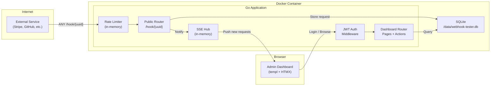
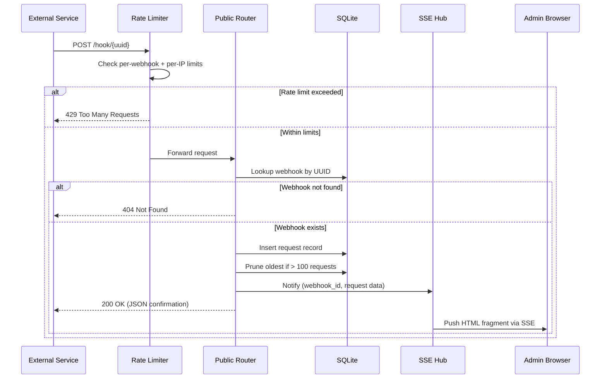
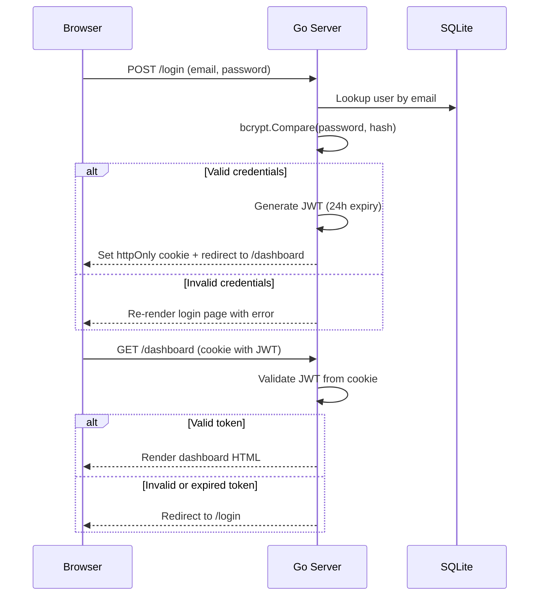

# System Architecture

## Architecture Diagram

## Component Responsibilities

| Component | Responsibility |
|-----------|----------------|
| **Public Router** | Receives incoming webhook requests at `/hook/{uuid}`. Validates webhook exists, stores request in SQLite, notifies SSE hub. Returns JSON response to caller. |
| **Rate Limiter** | In-memory middleware. Per-webhook and per-IP token bucket rate limits. Rejects excess traffic with 429 JSON response. |
| **Auth Middleware** | Validates JWT from httpOnly cookie on all dashboard routes. Redirects to `/login` if token is invalid or expired. |
| **Dashboard Router** | Serves HTML pages via templ and handles form actions (create/edit/delete webhook, change password, logout). |
| **SSE Hub** | Manages active SSE connections per webhook. When a new request is captured, pushes HTMX-compatible HTML fragment to connected clients. |
| **SQLite** | Single file database (`/data/webhook-tester.db`). Stores users, webhooks, and captured requests. Persisted via Docker volume. |

## Request Flow: Webhook Capture

## Authentication Flow

## Environments

| Environment | Purpose | Notes |
|-------------|---------|-------|
| Development | Local dev with Air hot-reload + Tailwind watch | `just dev` starts Air + Tailwind CLI in watch mode |
| Production | Docker container | `just build` creates image, `docker run` with volume for SQLite persistence |

## External Services

None. The application is fully self-contained with no external dependencies.
