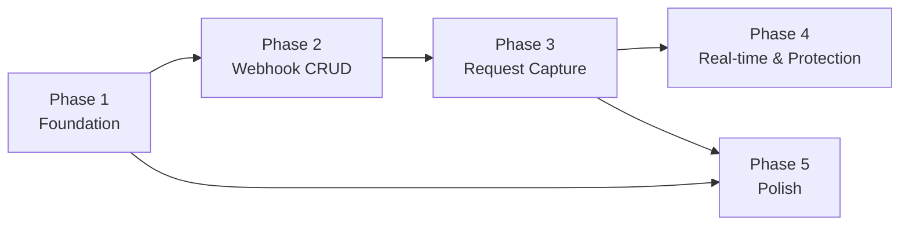

# Roadmap

## Phases

### Phase 1: Foundation

**Goal:** Project scaffolding, database setup, admin seed, authentication, and base layout with dark mode.

**Features Included:**

- #1 Admin seed (first-run seeding from env vars + `reset-password` CLI command)
- #2 Login (email/password form, JWT cookie)
- #4 JWT auth middleware (protect dashboard routes)
- #21 Dark/light theme toggle (Tailwind dark mode in base layout from day one)

**Dependencies:** None (starting point)

---

### Phase 2: Webhook CRUD

**Goal:** Create, list, edit, and delete webhooks. Core dashboard page is functional.

**Features Included:**

- #5 Create webhook (name, description, auto-generated UUID)
- #6 List webhooks (dashboard page with cards)
- #9 Delete webhook (with confirmation modal, cascade delete)
- #18 Edit webhook (update name/description)
- #10 Copy webhook URL to clipboard
- #19 Webhook request count badge

**Dependencies:** Phase 1 (auth must work to access dashboard)

---

### Phase 3: Request Capture & Display

**Goal:** Public webhook endpoint receives and stores HTTP requests. Webhook detail page displays captured requests with full inspection.

**Features Included:**

- #11 Receive webhook requests (public `/hook/{uuid}` endpoint, any HTTP method)
- #12 Handle non-existent webhook (404 JSON response)
- #7 View webhook detail (request list page)
- #8 View request detail (full inspection: method, headers, body, query params, IP, timestamp)
- #10 Copy request headers/body to clipboard

**Dependencies:** Phase 2 (webhooks must exist to receive requests)

---

### Phase 4: Real-time & Protection

**Goal:** Live updates via SSE when new requests arrive. Rate limiting and spam protection for public endpoints.

**Features Included:**

- #13 SSE real-time updates (HTMX SSE extension, live request prepend)
- #14 Rate limiting per-webhook (in-memory token bucket, 60 req/min)
- #15 Rate limiting per-IP (global per-IP limit)
- #16 Max body size (1MB limit, 413 response)
- #17 Request retention limit (keep last 100 per webhook, auto-prune)

**Dependencies:** Phase 3 (request capture must work to add real-time and protection)

---

### Phase 5: Polish

**Goal:** Settings page, password management, and UI polish.

**Features Included:**

- #3 Change password (settings page with current/new/confirm form)
- #20 Request body syntax highlight (pretty-print JSON/XML in request detail)

**Dependencies:** Phase 1 (auth for settings), Phase 3 (requests exist to highlight)

---

### Future (not in MVP scope)

- #22 Auto-expiry (delete inactive webhooks after N days)
- #23 Export requests (download as JSON)
- #24 Search/filter requests (by method, date, keyword)

---

## Dependency Graph

## Parallel Opportunities

- **Phase 5** can start after Phase 1 + Phase 3 complete — it does not depend on Phase 4
- Within **Phase 2**: dashboard UI (templ templates) and backend handlers (CRUD operations) can be built simultaneously
- Within **Phase 3**: public webhook endpoint (backend) and detail page templates (frontend) can be built in parallel once the request data model is shared
- Within **Phase 4**: SSE hub and rate limiter are independent components that can be developed in parallel
